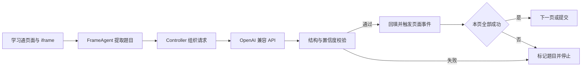

# 学习通 AI Toolkit

<div align="center">
  <p><strong>在学习通网页中调用 OpenAI 兼容模型完成题目解析与回填，并提供独立的 Puppeteer 题目采集工具。</strong></p>
  <p>
    <a href="#快速开始">快速开始</a> ·
    <a href="#能力概览">能力概览</a> ·
    <a href="#工作流程">工作流程</a> ·
    <a href="#开发与测试">开发与测试</a>
  </p>
</div>

本仓库包含两个互补入口：[`chaoxing-ai.user.js`](./chaoxing-ai.user.js) 直接运行在 Edge/Chrome 的 Tampermonkey 中；[`index.js`](./index.js) 使用 Puppeteer 打开独立 Edge 配置目录，将页面题目导出为 JSON、Markdown 和本地练习页。

## 能力概览

| 能力 | AI 网页脚本 | Puppeteer 采集器 |
| --- | :---: | :---: |
| 遍历当前页面和题目 iframe | ✓ | ✓ |
| 单选、多选、判断、填空、简答 | ✓ | ✓ |
| 提取题干、选项、公式和图片 | ✓ | ✓ |
| 调用 OpenAI 兼容 API | ✓ | — |
| 二次复核模型答案 | ✓ | — |
| 自动回填、翻页和提交 | ✓ | — |
| 导出 JSON / Markdown / HTML | — | ✓ |
| 复用独立 Edge 登录状态 | — | ✓ |

AI 网页脚本还包含以下停止保护：

- 模型答案必须通过题号、题型、选项和字段数量校验。
- 模型置信度低于阈值时停止，不继续翻页或提交。
- 默认开启二次复核，初选答案会再次让模型检查并可被改正。
- 页面重复、图片不可读取、API 超时或按钮无法唯一识别时停止。
- 首次模型响应格式错误时纠错重试一次；`response_format` 不兼容时自动降级。

## 快速开始

### 方式一：直接在网页中运行

1. 在 Edge 或 Chrome 中安装 [Tampermonkey](https://www.tampermonkey.net/)。
2. 打开 [`chaoxing-ai.user.js` 安装地址](https://raw.githubusercontent.com/xw9114/-test/main/chaoxing-ai.user.js)，在 Tampermonkey 中确认安装。
3. 登录学习通并进入作业、章节测验或练习页面。
4. 在右上角面板填写 API 配置，点击“开始答题”并确认本次执行。

脚本元数据已覆盖以下站点：

```text
*.chaoxing.com
*.chaoxing.cn
*.chaoxing.net
*.xueyinonline.com
*.edu.cn
*.nbdlib.cn
*.hnsyu.net
*.gdhkmooc.com
```

学校使用独立域名时，在 userscript 顶部新增对应的 `@match` 后重新保存。

### 方式二：采集题目到本地

采集器当前从以下 Windows Edge 路径启动浏览器：

```text
C:/Program Files (x86)/Microsoft/Edge/Application/msedge.exe
```

在 PowerShell 中运行：

```powershell
git clone https://github.com/xw9114/-test.git
Set-Location -LiteralPath ".\-test"
npm.cmd ci
npm.cmd run collect
```

浏览器打开后，手动登录并进入目标题目页面，再根据终端提示按 `Enter` 开始采集。也可以传入自定义起始 URL：

```powershell
npm.cmd run collect -- "https://passport2.chaoxing.com/login?newversion=true"
```

采集结果写入 `output/`：

```text
questions-YYYYMMDD-HHMMSS.json
questions-YYYYMMDD-HHMMSS.md
practice-YYYYMMDD-HHMMSS.html
```

## API 配置

网页面板中的配置会保存在 Tampermonkey 脚本存储中。

| 字段 | 默认值 | 说明 |
| --- | --- | --- |
| API Base URL | `https://api.openai.com/v1` | 可填写到 `/v1` 或完整 `/chat/completions` 地址 |
| API Key | 空 | 通过 `Authorization: Bearer ...` 发送 |
| Model | `gpt-4.1-mini` | 图片题需要选择支持视觉输入的模型 |
| 并发数 | `2` | 可配置范围为 1–6 |
| 超时 | `60000 ms` | 单次 API 请求超时 |
| 最低置信度 | `0.70` | 低于该值时停止自动流程 |
| 二次复核答案 | 开启 | 每题会多调用一次模型，速度和 token 成本约翻倍，但可降低自信误答 |
| 自动翻页并提交 | 开启 | 可关闭为“只回填、人工检查” |

兼容接口需要接受 Chat Completions 请求，并返回 `choices[0].message.content`。Base URL 末尾不是 `/chat/completions` 时，脚本会自动补全该路径。

API Key 不写入学习通页面的 `localStorage`，运行日志也不会输出密钥。题干、选项以及可读取的题目图片会发送到你配置的 API 服务；图片以 multimodal `image_url` data URL 形式提交。

### 提高正确率建议

- 优先使用更强模型，例如 `gpt-4.1` 或支持视觉输入的同级模型；小模型适合低成本扫题，但常识题、图片题和多选题更容易错。
- 保持“二次复核答案”开启；若接口费用敏感，再手动关闭。
- 首次在新课程/新题型中使用时，关闭“自动翻页并提交”，先人工抽查回填结果。
- 如果日志中经常出现低置信度，通常说明题干/选项提取不完整、图片无法识别，或模型本身能力不足；请把运行日志中的题干样本发出来继续适配。

## 工作流程



顶层控制器直接调用当前页面的扫描代理；只有子 iframe 使用带会话令牌的 `postMessage` 通信。回填时会触发 `input`、`change` 和 `blur` 事件，以兼容依赖前端事件更新状态的题目页面。

模型必须返回一个 JSON 对象：

```json
{
  "questionId": "q1",
  "type": "single",
  "answerKeys": ["A"],
  "fillAnswers": [],
  "shortAnswer": "",
  "explanation": "计算或判断依据",
  "confidence": 0.95
}
```

选择题和判断题使用 `answerKeys`，填空题按输入框顺序使用 `fillAnswers`，简答题使用 `shortAnswer`。未使用的答案字段返回空数组或空字符串。

## 项目结构

```text
.
├── chaoxing-ai.user.js      # Tampermonkey AI 回填脚本
├── index.js                  # Puppeteer 题目采集器
├── package.json              # Node.js 命令与依赖
├── tests/
│   ├── fixture.html          # 常见题型与提交确认 fixture
│   ├── frame.html            # 跨域图片题 fixture
│   └── userscript.test.js    # Puppeteer 自动化测试
└── README.md
```

`.edge-profile/` 保存采集器的独立浏览器状态，`output/` 保存采集结果；两者均已加入 `.gitignore`。

## 开发与测试

```powershell
npm.cmd ci
npm.cmd test
```

测试使用两个本地 HTTP 端口模拟页面和跨域 iframe，并 mock `GM_xmlhttpRequest`。当前自动化场景覆盖：

- 五种常见题型、学习通 `.mark_name/.answer_p/answertype` 作业结构、自定义 `div` 选项及跨域图片题回填。
- 考试预览页通过页面级 `input[name^="type"]` 识别题型。
- multimodal 图片请求、`response_format` 降级和无效 JSON 重试。
- 输入事件触发、确认提交和伪造 iframe 消息拒绝。
- API 超时后停止，且不回填、不提交。

测试只访问本机 fixture，不会登录学习通，也不会请求真实 AI API。

## 常见问题

<details>
<summary><strong>页面没有出现控制面板怎么办？</strong></summary>

先核对当前域名是否匹配 userscript 的 `@match`。独立学校域名需要手动加入元数据；修改后刷新题目页面。

</details>

<details>
<summary><strong>为什么识别成功后没有自动提交？</strong></summary>

检查面板中的失败数量和运行日志。任意题目解析失败、置信度不足或页面存在多个候选提交按钮时，自动流程都会停止。

</details>

<details>
<summary><strong>兼容服务不支持 response_format 怎么办？</strong></summary>

当接口返回 `400`、`404` 或 `422` 时，脚本会移除 `response_format` 并重试。模型仍需在消息内容中返回可解析的 JSON 对象。

</details>

<details>
<summary><strong>图片题只发送图片 URL 吗？</strong></summary>

不是。脚本优先读取图片内容并转为 data URL；读取失败但存在有效 `alt` 时改用替代文本，两者都不可用时停止当前流程。

</details>
